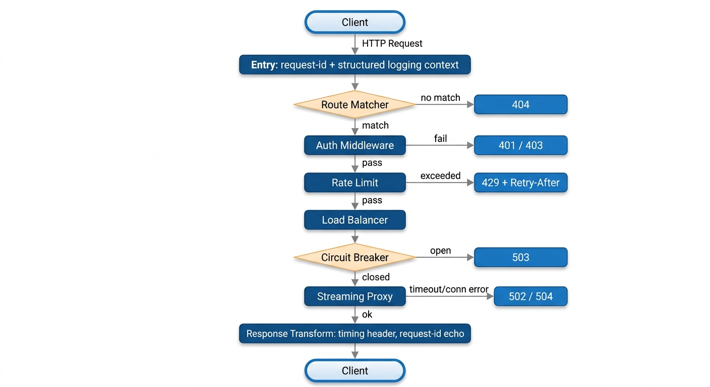

# Design Decisions

This document records the significant design decisions made while building this API Gateway, the trade-offs considered, and the items intentionally deferred.

---

## Table of Contents

- [Development and Deployment Approach](#development-and-deployment-approach)
- [Architecture Overview](#architecture-overview)
- [Framework](#framework)
- [Route Matching](#route-matching)
- [Header Handling](#header-handling)
- [Middleware Chain](#middleware-chain)
- [Rate Limiting Algorithm](#rate-limiting-algorithm)
- [Race Conditions in Rate Limiting](#race-conditions-in-rate-limiting)
- [Fail Open vs Fail Closed](#fail-open-vs-fail-closed)
- [Rate Limit Response Headers](#rate-limit-response-headers)
- [Mock Auth Provider Location](#mock-auth-provider-location)
- [Auth: Where Scope and Permission Checks Live](#auth-where-scope-and-permission-checks-live)
- [Config Storage](#config-storage)
- [Hot Reload](#hot-reload)
- [Service Discovery](#service-discovery)
- [Route Target Configuration: Single vs Multi-Target](#route-target-configuration-single-vs-multi-target)
- [Connection Pooling](#connection-pooling)
- [Circuit Breaker](#circuit-breaker)
- [Metrics](#metrics)
- [Error Handling](#error-handling)
- [One Thing I Would Do Differently With More time](#one-thing-i-would-do-differently-with-more-time)

---

## Development and Deployment Approach

The project was developed and tested exclusively against **local resources** — the gateway, mock backends, and (when needed) Redis and Postgres run as native processes on the developer machine. Docker Compose support is fully implemented (`docker-compose.yml`, `Dockerfile`, `routes.docker.yaml`, `.env.docker`), but it was **never actually executed end-to-end** because my home computer does not have the resources to run the full Compose stack comfortably.

The consequence: everything that touches Compose specifically (service-name DNS resolution, container-to-container networking, the `depends_on` health-check ordering, the auto-applied Postgres schema init) is written to spec but **unverified**. If you run `docker compose up --build` and something misbehaves, that is the most likely cause. All non-Compose paths — local dev, unit tests, in-memory rate limiting, YAML routes, and standalone Redis/Postgres pointed to via env vars — are verified.

---

## Architecture Overview

The gateway is a single asynchronous FastAPI application. A catch-all handler in `src/gateway/main.py` receives every request, matches it against the in-memory `RouteRegistry`, runs the configured middleware chain, and forwards the request to an upstream backend via a shared `httpx.AsyncClient` in streaming mode.

Request flow:
[](assets/request-flowchart.png)

Pluggable components sit behind Protocol interfaces (`AuthProvider`, `RateLimitStore`, `RouteRepository`) so implementations swap by env var: memory ↔ Redis, YAML ↔ Redis ↔ Postgres, mock JWT ↔ OIDC. No code changes required per swap.

---

## Framework

FastAPI for Admin, auth, and health endpoints — dependency injection, Pydantic validation, and auto-generated Swagger UI. Starlette streaming primitives (`StreamingResponse`, `httpx.AsyncClient.stream()`) for the proxy path so large request or response bodies are never buffered.

---

## Route Matching

**Chosen algorithm:** exact match plus `/*` suffix wildcard. No regex — deliberately excluded to keep matching predictable and O(n) over the route list.

**Selection order when multiple routes match:**

1. Higher `priority` field wins.
2. Longer pattern wins (more specific).
3. Exact match beats wildcard.
4. Ties beyond that fall back to registry insertion order (stable sort). Operators should set explicit `priority` values when disambiguation matters — relying on insertion order is fragile.

Method filtering is applied first: a route only becomes a candidate if its `methods` list includes the request method.

Implementation lives in `src/gateway/routes/matcher.py`. The `priority` field is defined on the `Route` model in `src/gateway/routes/models.py` (default `0`).

### Regex and Path Parameters — Not Supported

The matcher supports only two forms: exact match (`/api/users`) and `/*` suffix wildcard (`/api/users/*`). Regex patterns and named path parameters like `/api/users/{id}` are deliberately excluded.

**Three reasons:**

1. **Predictable performance.** Regex backtracking can be catastrophically slow on adversarial input. A simple loop over exact-and-wildcard patterns is guaranteed O(n) with tiny constants.
2. **Predictable matching.** With regex, two overlapping patterns can match in surprising orders. Exact-vs-wildcard has a clear, documented precedence rule.
3. **The gateway does not need to extract parameters.** Value extraction (id, tenant, resource) is the backend's job — the gateway just needs to know which backend to forward to. Wildcards are sufficient for that.

### What to Do Instead

**For a "match any id under this path" case** (/api/users/{id}), use the wildcard:

```yaml
- id: users-detail
  path: /api/users/*
  target: http://user-service:8080
  strip_prefix: /api/users
```

`GET /api/users/42` reaches the backend as `GET /42`. The backend is responsible for parsing `42` as the id — that is normally what a REST backend does anyway (via its own routing framework: FastAPI's `/{id}`, Express's `:id`, etc.).

**For different behavior on different HTTP methods**, split into two routes:

```yaml
- id: users-list      # collection endpoints
  path: /api/users
  methods: [GET, POST]
  target: http://user-service:8080

- id: users-detail    # individual items and sub-resources
  path: /api/users/*
  methods: [GET, PUT, DELETE]
  target: http://user-service:8080
```

The matcher prefers exact matches over wildcards, so `/api/users` hits the first route and `/api/users/42` hits the second.

### If You Truly Need Regex

A third pattern type could be added (e.g., `path: "regex:^/api/users/(?P<id>\\d+)$"`) by extending `_match_pattern` in `src/gateway/routes/matcher.py`. Before doing so, evaluate whether the backend framework's own routing is a better place for that logic — it almost always is. If regex is added, the priority ordering must be extended to place regex patterns explicitly (probably below exact match, above or below wildcard depending on desired specificity), and performance guarantees must be re-evaluated per pattern.

---

## Header Handling

- Hop-by-hop headers stripped: `Connection`, `Keep-Alive`, `TE`, `Trailers`, `Transfer-Encoding`, `Upgrade`, `Proxy-Authenticate`, `Proxy-Authorization`, `Host`, `Content-Length`.
- `Host` and `Content-Length` are re-derived by httpx.
- `X-Forwarded-For` appended (prior value preserved); `X-Real-IP` and `X-Forwarded-Proto` set.
- `X-Request-ID` generated if missing, propagated to backend and echoed back to the client.
- Client-forbidden headers (`X-User-*`, `X-Gateway-*`) stripped from incoming requests so identity cannot be spoofed. See "Auth: Where Scope and Permission Checks Live" for details.

---

## Middleware Chain

The gateway pipeline has two categories of middleware:

| Category | Where defined | Who controls order | User can disable? |
|---|---|---|---|
| **Built-in (framework-level)** | Hardcoded in `gateway_handler` in `src/gateway/main.py` | Framework only (fixed) | Only Auth and Rate Limit (by omitting from `middlewares:` list). The rest run for every request. |
| **Custom (registry-based)** | Files in `src/gateway/middlewares/` | Route's `middlewares:` list order | Yes — omit from the list |

#### Fixed pipeline order

Order: RequestID (built-in, always) → Metrics start (built-in, always) → Auth (built-in, opt-in) → Rate Limit (built-in, opt-in) → Request Transform (built-in, always) → Proxy (built-in, always) → Response Transform (built-in, always) → Metrics end (built-in, always). \
The order is enforced by `src/gateway/main.py` and cannot be changed via configuration. Auth must run before Rate Limit so denied users are not counted against their bucket; both must run before Proxy so a rejected request never touches the backend; RequestID must run first so downstream stages have a correlation id.

#### Middleware list validation

At startup and on every route reload, the gateway inspects each route's `middlewares:` list and emits WARN logs for common misconfigurations.

**How valid names are determined.** A name is valid if it appears in one of three sources:

1. **Registered custom middlewares** — every name in `_REGISTRY` from `src/gateway/middlewares/base.py` (populated automatically by the auto-importer as each module in `src/gateway/middlewares/` calls `register_middleware`).
2. **Opt-in built-ins** — the constant `OPT_IN_BUILTINS = {"auth", "rate_limit"}`. These names toggle built-in stages for the route.
3. **Reserved built-ins** — `RESERVED_BUILTINS = {"request_id", "metrics_start", "metrics_end", "request_transform", "response_transform", "proxy"}`. These names refer to built-in stages that always run at fixed positions and must never appear in the list; presence triggers a specific "reserved name" warning.

Anything not in sources 1 or 2 and not matching source 3 is treated as an unknown name (probably a typo).

**Warnings emitted:**

- **Unknown name** — silently ignored at runtime; the warning catches typos.
- **Reserved name** — presence has no runtime effect but signals a misunderstanding of the pipeline.
- **Suspicious order** — `rate_limit` or a custom middleware appearing before `auth` in the list. The list does not reorder built-in stages, so Auth still runs before Rate Limit; the warning encourages fixing the list to match the real pipeline.

**Strict mode (`GATEWAY_STRICT_VALIDATION`).**

- **Default (`false`)**: warnings only; misconfigured routes still start. Gateway availability is preserved.
- **Strict (`true`)**: at startup, if any issue is found, the gateway aggregates every issue into a single `MiddlewareValidationError` and aborts before serving traffic. This is the recommended setting for production and CI so misconfigurations are caught deterministically at deploy time.

Strict mode intentionally applies only at startup. On `/admin/reload`, validation issues are downgraded to WARN logs and the reload still succeeds. Rationale: a strict check at reload could take a running gateway offline because of a single bad admin write. The failure model is asymmetric on purpose — hard fail at boot, soft fail during operation.
(the gateway is already up and successfully handling traffic. Someone — an operator, a CI job, an Admin API call — pushes a new route configuration. If that configuration has a validation issue and the reload raises: a running gateway should not be killed by it.)

#### Types of middleware

| Middleware | Type | Order in pipeline | Required? | Configurable per route? | Depends on |
|---|---|---|---|---|---|
| RequestID / Logging entry | Built-in | 1 | Must (always runs) | No | — |
| Metrics start | Built-in | 2 | Must (always runs) | No | RequestID |
| **Auth** | Built-in, opt-in via `middlewares:` | 3 | Optional | Yes (`scopes`, `required`) | RequestID |
| **Rate Limit** | Built-in, opt-in via `middlewares:` | 4 | Optional | Yes (`capacity`, `refill_per_second`) | Runs after Auth if both configured, so per-user limits work correctly |
| Request Transform | Built-in | 5 | Must (always runs) | No (behavior is fixed: header stripping, X-Forwarded-*) | RequestID |
| Custom middlewares | Registry | between Request Transform and Proxy, in list order | Optional | Yes (arbitrary config) | Whatever the middleware needs |
| Proxy | Built-in | 6 | Must (always runs) | Behavior fixed; targets configurable per route | Load Balancer + Circuit Breaker |
| Response Transform | Built-in | 7 | Must (always runs) | No | Proxy |
| Metrics end | Built-in | 8 | Must (always runs) | No | — |

#### What each middleware do

- **RequestID / Logging** — assigns `X-Request-ID` if the client did not send one; binds it into every log line for the request, so every log line and metric carries the correlation id. Code location: `gateway_handler` in `src/gateway/main.py`.
- **Metrics start / end** — records duration, status, in-flight count for Prometheus. Code location: `src/gateway/observability/metrics.py` (definitions); bracketed inside `gateway_handler`.
- **Auth** — Verifies JWT signature, `iss`, `aud`, `exp` via the configured `AuthProvider`; enforces `middleware_config.auth.scopes`; injects `X-User-Id`, `X-User-Scopes`, `X-User-Email`. Code location: `gateway_handler` in `src/gateway/main.py`; provider in `src/gateway/auth/`.
- **Rate Limit** — Token-bucket check via the configured `RateLimitStore`; adds `X-RateLimit-*` on every response, `Retry-After` on 429; honors `GATEWAY_RATE_LIMIT_FAIL_MODE`. Code location: `gateway_handler`; stores in `src/gateway/rate_limit/`.
- **Request Transform** — strips hop-by-hop headers, strips client-forbidden headers (`X-User-*`, `X-Gateway-*`), adds `X-Forwarded-For`, `X-Real-IP`, `X-Forwarded-Proto`. Code location: `filter_headers()` and body of `proxy_request()` in `src/gateway/proxy/streaming.py`.
- **Proxy** — Streams the request to the selected backend via the shared `httpx.AsyncClient`; integrates with load balancer and circuit breaker. Code location: `proxy_request()` in `src/gateway/proxy/streaming.py`; client in `src/gateway/proxy/client.py`.
- **Response Transform** — adds `X-Gateway-Duration-Ms` and echoes `X-Request-ID` back to the client, appends rate-limit headers. Code location: `gateway_handler` in `src/gateway/main.py`.

#### Relationships between middlewares

- **Rate Limit without Auth** is allowed. The rate-limit key falls back to the client IP address when no `X-User-Id` is available. This is coarser (a NATed office shares a bucket) but functional.
- **Rate Limit with Auth** is the intended pairing: the key becomes `route:user_id`, giving per-user quotas.
- **Custom middlewares** may declare their own dependencies in documentation; the registry does not enforce them.

#### Custom middleware ordering

The route's `middlewares:` list controls two things:
1. Which of Auth and Rate Limit are enabled (by listing `auth` and/or `rate_limit`).
2. The order of any *custom* middlewares from the registry, among themselves.

It does not let you reorder built-in stages. \
You cannot run a custom middleware **before** Auth via the list. Custom middlewares always run between Request Transform and Proxy

#### Adding Custom middleware
Middlewares are pluggable via a registry in `src/gateway/middlewares/base.py`. A `middlewares/__init__.py` auto-imports every module in the package, so adding a new middleware is a one-file drop with no changes to `main.py`. Middlewares run sequentially; each returns `MiddlewareResult()` to continue or `MiddlewareResult(short_circuit=Response(...))` to end the chain early with a custom response.

#### Middleware configuration
Per-route configuration selects which middlewares run and passes per-middleware options via `middleware_config`.

---

## Rate Limiting Algorithm

| Algorithm | Pros | Cons |
|---|---|---|
| Fixed Window | Trivial, cheap | 2× burst at window edges |
| Sliding Window Log | Perfectly accurate | Stores every timestamp |
| Sliding Window Counter | Cheap approximation | Slight inaccuracy under bursts |
| **Token Bucket** ← chosen | Allows bursts, industry standard, intuitive config | Two state values |
| Leaky Bucket | Smooth output | No bursts allowed |

Chosen: token bucket. Matches real user traffic (idle then burst), config (`capacity`, `refill_per_second`) is intuitive.

---

## Race Conditions in Rate Limiting

- **In-memory**: per-key `asyncio.Lock`.
- **Redis**: atomic Lua script via `EVAL` — reads state, refills, decrements, writes back, expires the key, all in one server-side operation. No round-trip race.

---

## Fail Open vs Fail Closed

- **Fail Open** (chosen default): if the rate-limit store is unreachable, allow the request. Gateway availability > perfect enforcement.
- **Fail Closed**: return 503. Prioritizes protection but ties gateway uptime to the store.

Configurable via `GATEWAY_RATE_LIMIT_FAIL_MODE`.

### Not silent

Fail-open is intentionally noisy so operators know when it is triggering. On every rate-limit store error the gateway:

- Emits a structured **WARN log**: `rate_limit.store_error` with the error message and the request-id in context.
- Increments Prometheus counters — a dedicated `gateway_rate_limit_store_errors_total` should be added so alerts can fire on a rising rate (currently only the generic `gateway_backend_errors_total` is affected).

Alerting rule of thumb: if fail-open events exceed a low threshold per minute, treat it as a Redis outage even if requests keep flowing. Gateway availability is preserved but rate limits are not being enforced during the outage.

---

## Rate Limit Response Headers

Every response includes `X-RateLimit-Limit`, `X-RateLimit-Remaining`, `X-RateLimit-Reset`. On 429 also `Retry-After` in seconds. Follows the `draft-ietf-httpapi-ratelimit-headers` conventions.

---

## Mock Auth Provider Location

The mock provider lives inside the gateway as isolated modules (`src/gateway/auth/mock_provider.py` and `src/gateway/auth/router.py`), mounted only when `GATEWAY_AUTH_BACKEND=mock`. Removable by deleting two files and one conditional include line in `main.py`.

Trade-off: 
   - simpler dev experience;
   - does not mirror production topology exactly. 

Deferred: extracting the mock to its own compose service.

---

## Admin API Authentication

The Admin API (`/admin/*` endpoints for route CRUD and reload) is protected by a **static shared token** passed in the `x-admin-token` header, configured via `GATEWAY_ADMIN_TOKEN`. This is intentionally separate from the JWT-based auth used for regular proxied traffic — the two credential spaces do not overlap.

**Why a static token instead of JWT/mTLS/basic auth:**

- **Simplicity.** No IdP dependency for admin operations. The gateway can be reconfigured even when the auth provider is down.
- **Operational fit.** Admin calls come from CI pipelines, ops scripts, and humans — all of which can trivially include a header. JWT flows add moving parts (token acquisition, refresh) that are unnecessary for infrastructure operations.
- **Separate credential space.** A leaked user JWT should never grant admin access, and a leaked admin token should never authenticate as a user. Keeping the two mechanisms distinct enforces this by construction.

---

## Auth: Where Scope and Permission Checks Live

Two-tier model.

**Gateway — coarse-grained (implemented):**

- Validates JWT signature, `iss`, `aud`, `exp`.
- Checks **top-level scopes** declared on the route in `middleware_config.auth.scopes`.
- Example: route `/api/users/*` requires scope `users:read`. Any token missing that scope is rejected with **403** before the request reaches the backend.
- Injects verified identity into upstream headers: `X-User-Id`, `X-User-Scopes`, `X-User-Email`.

Location: the auth middleware block inside `gateway_handler` in `src/gateway/main.py`.

**Backend — fine-grained (backend's responsibility):**

- Trusts the injected `X-User-*` headers — only safe when the gateway is the sole ingress (enforce via network isolation, mTLS, or signed headers).
- Enforces ownership and resource-level rules: "does user `X-User-Id` own `/users/42`?", "is this tenant allowed to see this record?", "does the requested action match the user's role on this specific object?".
- The gateway cannot make these decisions — it does not know the backend's data model.

**Rule of thumb:**

- "Does this token have permission to call this endpoint at all?" → gateway.
- "Does this specific user have permission to touch this specific object?" → backend.

### Empty Scopes List Behavior

The `scopes` field on `AuthMiddlewareConfig` defaults to an empty list. The gateway only runs the scope check when the list is non-empty — an empty list means "any valid token is accepted, no scope requirement." Combined with the `required` flag this gives four configurations:

| `required` | `scopes` | Result |
|---|---|---|
| `true` | `[]` | Any valid token accepted; scopes ignored |
| `true` | `["users:read"]` | Token must carry `users:read` (403 otherwise) |
| `false` | `[]` | Fully public route; token optional |
| `false` | `["users:read"]` | If token supplied it must have the scope; missing token still allowed |

This makes it easy to progressively tighten a route: start with `required: true, scopes: []` while integrating auth, then add specific scopes once callers are updated.

### Securing Injected Identity Headers

The backend trusts `X-User-Id`, `X-User-Scopes`, `X-User-Email` because the gateway is the sole ingress. The gateway hardens this contract in three ways:

1. **Client-forbidden header stripping (implemented).** A small but important hardening: the proxy's `filter_headers()` in `src/gateway/proxy/streaming.py` strips any incoming `X-User-*` and `X-Gateway-*` headers before the auth middleware runs. Without this, a client could send `X-User-Id: admin` and — if the auth middleware left it untouched — have the backend see a forged identity. With the strip, the gateway is guaranteed to be the only source of these headers seen by the backend.
2. **Network isolation.** Backends do not accept traffic from outside the internal network (enforced at the Docker Compose network / firewall level).
3. **Deferred hardening options for stronger environments:**
   - Shared secret header (`X-Gateway-Secret`) verified by backends.
   - mTLS between gateway and backends.
   - Signed identity tokens (short-lived internal JWT or HMAC-signed header set).

For the current single-tenant deployment, options 1 and 2 are sufficient. When we move to shared infrastructure or add compliance requirements, we will implement the shared-secret layer first, then evaluate signed identity tokens.

---

## Route Storage (the design view)

`RouteRepository` interface with three implementations: YAML file, Redis, Postgres. YAML chosen for phase-1 defaults — git-versionable, trivial local dev, human-readable. Swap via `GATEWAY_ROUTE_REPO_BACKEND`.

YAML was chosen over JSON specifically because it supports comments.

---

## RouteRegistry

The `RouteRegistry` (in `src/gateway/routes/registry.py`) is the in-memory hot cache of routes. Every incoming request matches against it; the persistent repository is never touched on the request path.

Design properties:

1. **In-memory list of `Route` objects.** Plain `list[Route]` of already-validated Pydantic models. Matching is a Python loop over the list — O(n), but n is small (typically dozens) and each comparison is cheap.

2. **Populated from a `RouteRepository`.** The registry does not know which storage backend it uses. It receives a `RouteRepository` (Protocol) and calls `.list()` on it during `load()` and `reload()`. This is the seam that lets YAML/Redis/Postgres swap without touching request-handling code.

3. **Atomic snapshot swap on reload.** `reload()` acquires a lock, calls `repo.reload()` to get a fresh list, and replaces the internal reference in a single assignment. In-flight requests continue to see the old snapshot (Python name rebinding is atomic under the GIL). New requests immediately see the new snapshot. No half-updated state is ever visible.

4. **Per-instance, not shared.** Each gateway process holds its own copy. Multi-instance deployments require explicit reload on every instance, which is why Redis pub/sub auto-reload is planned (see "Hot Reload" → Level 3).

`match()` is the hot-path method. It calls the matcher in `src/gateway/routes/matcher.py`, which applies method filtering, path pattern matching, and priority selection over the list.

---

## Hot Reload

- **Level 1 (chosen and implemented):** `POST /admin/reload` — atomic snapshot swap. The registry builds a new list in a temp variable, then swaps under a lock. In-flight requests continue to see the old snapshot.
- **Level 2 (deferred):** file watcher (`watchfiles`) for local dev. Not implemented because it is not useful in Docker/K8s (file is baked into the image) and not useful multi-instance (each instance sees only its own filesystem). Easy to add: an `asyncio` task that awaits `awatch(routes_file_path)` and calls `registry.reload()` on events.
- **Level 3 (deferred):** Redis pub/sub for multi-instance auto-reload (see next section).

Doubt: multi-instance reload consistency requires Level 3; without it, instances can be temporarily out of sync between the write and each instance's next explicit reload call.

### Multi-Instance Route Sync (Redis Pub/Sub) — deferred

When more than one gateway instance runs behind a load balancer, each holds its own in-memory `RouteRegistry`. If instance A mutates a route via the Admin API, instance B's snapshot stays stale until someone calls `POST /admin/reload` on it explicitly.

Redis pub/sub solves this: `RedisRouteRepository._notify()` already publishes an event on the `gw:routes:changed` channel on every mutation. The missing half is a subscriber — a background task on every instance that listens to that channel and calls `registry.reload()` on each event. The result is that one Admin API call propagates to the whole fleet in milliseconds.

**Not implemented for now** because the current deployment target is a single gateway instance. When we scale horizontally, adding the subscriber is a small change (an `asyncio` task started in `lifespan()` when `route_repo_backend == "redis"`). Interfaces and the publish side are already in place, so no refactor is required.
Trade-off: with one instance the design is dramatically simpler (no cache-coherence problem, no pub/sub race conditions to reason about, no cluster-wide reload ordering).

---

## Service Discovery

Both supported in the same route schema — internally normalized to a `targets` list, so one code path.

- **Option 1 — single `target`**: for Docker Compose / Kubernetes where the orchestrator handles DNS + health-based restart. Simpler.
- **Option 3 — `targets` list + health checks + round-robin**: for bare metal or when application-level health matters. Integrates with circuit breaker.

Trade-offs: Option 1 defers everything to the orchestrator; Option 3 gives the gateway application-level awareness at the cost of duplicated work when running under an orchestrator.

### Circuit breaker vs orchestrator responsibilities

The recommendation "use `target` under Docker/Kubernetes, `targets` on bare metal" is about who owns **load balancing and health checks**, not the circuit breaker. Under Compose/K8s the orchestrator's DNS and restart policy handle instance-level LB and health, so the gateway stays simple. On bare metal you list the instances explicitly and let the gateway health-check and round-robin them.

The circuit breaker applies to **both** modes. It tracks failures per backend URL. With a single-target route it still trips after `failure_threshold` upstream errors — the route just has one backend to trip. Under Docker Compose with `target: http://echo-service:8080`, if echo-service is down, the breaker opens and the gateway returns 503 immediately instead of waiting for the timeout on every subsequent request.

---

## Route Target Configuration: Single vs Multi-Target

Supports both `target` (string) and `targets` (list). Normalized to a single-item list internally. A route can move between the two forms at any time with no code changes. See the route configuration examples in `README.md`.

---

## Connection Pooling

Single long-lived `httpx.AsyncClient` created at app startup and closed on shutdown. Tuned `Limits` (`max_connections=200`, `max_keepalive_connections=100`, `keepalive_expiry=30s`). Streaming via `client.stream()` — request and response bodies are never buffered.

Rationale: creating a fresh TCP + TLS connection per proxied request is catastrophic for latency and throughput. `httpx` handles pooling and keepalive per host automatically. A single shared client is simpler than per-backend clients and sufficient because pooling is per-host inside httpx.

---

## Circuit Breaker

In-house implementation. Per-backend key. States: CLOSED / OPEN / HALF-OPEN. \
Opens after `failure_threshold` consecutive failures; cools down for `cooldown_seconds`; allows `half_open_max_calls` probes before fully closing. Feeds into load balancer eligibility.

Rationale: without a breaker, a dead backend causes every request to wait the full timeout, exhausting gateway connections and cascading the outage. With a breaker, requests fail fast (503) after the threshold is crossed, protecting the gateway and giving the backend room to recover.

---

## Load Balancer

A single strategy is implemented today: **round-robin** across the healthy targets of a route. Implementation lives in `src/gateway/backends/load_balancer.py`.

**Eligibility filter — feeds from the circuit breaker.** When the load balancer picks a target for a request, it filters the target list through the circuit breaker's `allow(target)` method. If a target's circuit is OPEN, it is skipped. If all targets are OPEN, the LB returns `None` and the gateway responds with 503.

The consequence: the circuit breaker does not just refuse individual calls — it makes bad targets **invisible to the load balancer** for the cooldown period. In a multi-target route, traffic shifts to healthy instances automatically. In a single-target route, requests fail fast (503) without hitting the dead backend, protecting gateway threads and giving the backend room to recover.

Future strategies (deferred): least-connections, weighted, random. Adding one means implementing a new `LoadBalancer` class and selecting it via the `load_balancer:` field in the route config — no changes to the request pipeline required.

---

## Metrics

`prometheus-client` from day one. Four golden signals plus gateway specifics (rate-limit denials, auth failures, backend errors, circuit state).

### Zero-overhead when scraping is off

Prometheus is a **pull** model. The gateway just increments in-process counters and histograms — cheap integer/atomic operations, no network, no serialization. If nothing ever scrapes `/metrics`, that data sits in memory unused and costs essentially nothing (a few kilobytes plus nanoseconds per request to bump counters).

The point: adding metrics from day one does not slow the gateway down even if you are not running Prometheus. You pay the tiny cost of `counter.inc()` regardless, and only when a scraper hits `/metrics` does the exposition-format serialization happen — and even that is a few milliseconds once per scrape interval (typically 5–30 seconds), not per request.

### Why day-one

Metrics were included from day one intentionally. Adding observability after the fact almost always requires touching every code path — middleware boundaries, error paths, background tasks — which is disruptive and error-prone. Starting with the plumbing in place means new features get metrics for free.

---

## Error Handling

Uniform JSON error body `{"error": "..."}`. No stack traces, no upstream URLs, no internal IPs leaked.

Status codes:

| Code | Meaning |
|---|---|
| 401 | Missing or invalid token |
| 403 | Valid token, missing required scope |
| 404 | No route matched |
| 429 | Rate limit exceeded (with `Retry-After`) |
| 502 | Upstream connection error or non-timeout upstream failure |
| 503 | Rate-limit store unreachable (fail-closed) or no healthy backend / circuit open |
| 504 | Upstream timeout |

---

## One Thing I Would Do Differently With More time
It isn't any specific feature that I would have developed better, but rather the development process itself. If I had more time, I would have been more hands-on with the code, covered it with more tests, and given it a bit more thought before rushing into development. Consequently, both the application's design and the code itself would likely have been of higher quality and more precise.

---
